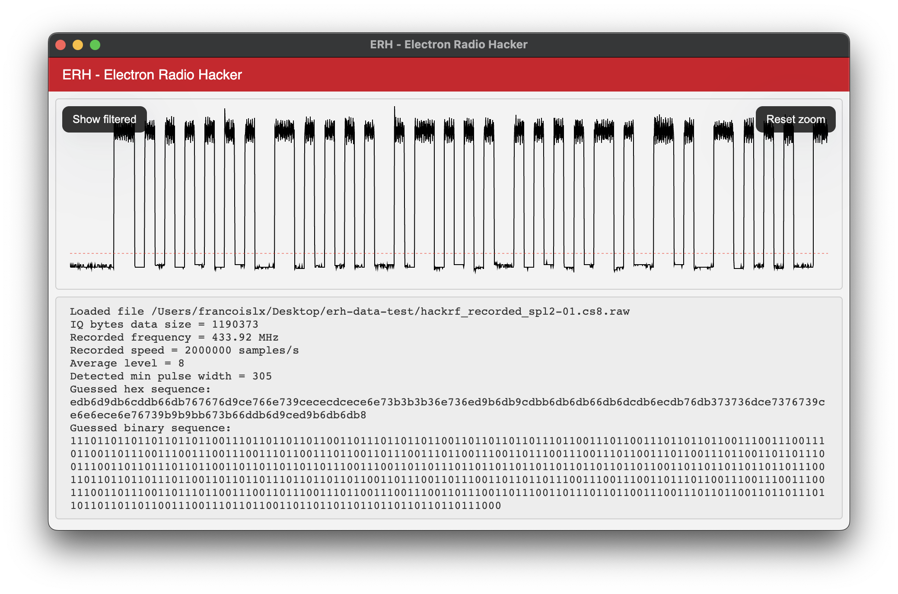

# ERH - Electron Radio Hacker

Proof-of-concept inspired by [URH](https://github.com/jopohl/urh), built with TypeScript Node, Electron and React.

> 💅 Current status is early stage / work in progress, mostly to test features, and it currently only supports [OOK](https://www.wikiwand.com/en/On%E2%80%93off_keying) modulation.



## Features

- IQ complex data translation into reals
- OOK signal demodulation (low-pass filter)
- Minimum pulse width detection
- Data decoding
- Hex and binary data display
- Efficient infinite radio data / filtered data zoom

## Supported files types

- `*.cs8` (HackRF IQ signed 8 bits integers), **currently limited to 100MiB**

## Install & run

```
git clone git@github.com:rascafr/ERH.git
cd ERH
npm i
npm start
```

## Credits

- Helpful details about [RF file formats](https://www.sdrplay.com/community/viewtopic.php?t=3483)
- Based on [electron-react-boilerplate](https://electron-react-boilerplate.js.org/)
